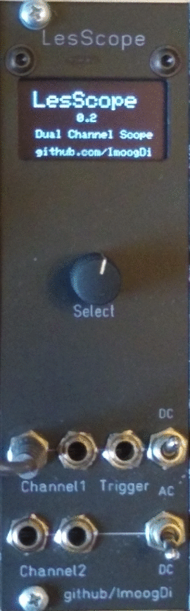
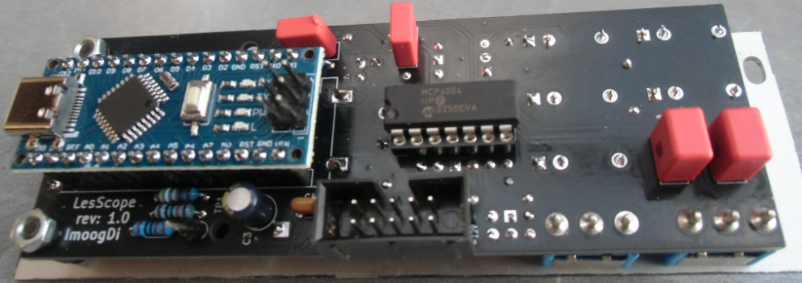
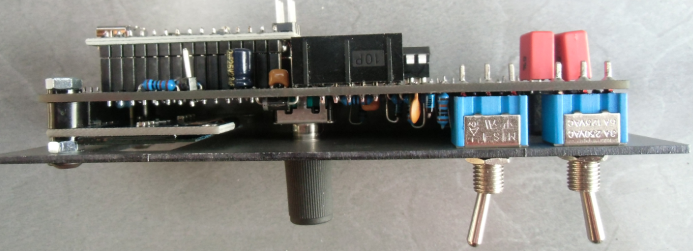
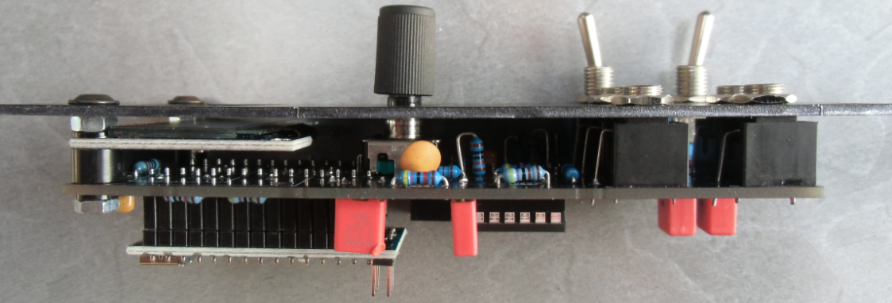
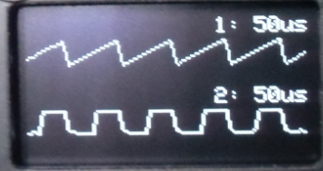
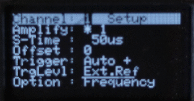

# LesScope
Arduino based Dual Channel Scope for eurorack-modular synths.

**Table of Contents**

- [Introduction](#intro)
- [Construction Guide](./doc/constructionguide.md)
- [LesScope-Menu](#menu)
- [Technical data](#technical-data)
- [References](#references)
- [License](#license)

## Introduction

This eurorack-modul is designed for modular-synthesizers as dual channel scope modul.  
Only two active parts are required to sample the signal at the jack-inputs.  
 1. Arduino Nano V3.x.  
 2. Quad Op Amp MCP6004 rail-to-rail input/output.  

The Arduino Nano samples the amplified signal on two 10-Bit A/D multiplexed inputs.  
Sampled-data are then traced on the 1.3'' OLED display.  
Dataentry and menu-selections are possible with that encoder <u>Select</u>.  
AC/DC coupling is selectable for both channels on two switches.  
Every channel has two jacks linked together for signal-input and routing to other inputs.  
That signal on <u>Channel1</u> is normalized to the <u>Trigger</u> input-jack.  
With an additonal cable plugged into the <u>Trigger</u> jack a different trigger-signal can be used.  

All parts are common available and DIY-friendly designed.   
(Details see attached pictures)  

- Modul Frontpanel  
 

- Modul Backside  
 

- Modul Right side  
 

- Modul Left side  
 

- Dual Trace example  
 

## LesScope-Menu
- Menu example  
 

## Technical data

- size:  
  height: 3VP (133,35mm)  
  width : 8HP ( 40,3mm)  
  depth : 35mm

- power:  
   +5Volt, 0 mA  
  +12Volt, 45mA  
  -12Volt, 0 mA  

- display:  
    128x64 pixel 1.3inch OLED with SPI interface  

- MCU:  
    Arduino Nano V3.x ATmega 328P  

- Electrical features:  
    Rotary encoder with push-button.  
    Two separate channels with AC/DC-coupling.  
    Input Voltage 10Vp-p for both channels.  
    Menu selectable signal-amplification (1...4:Channel1; 1...2:Channel2).  
    Sampling-rate range: 50us...100msec on both channels.  
    Separate trigger-input (default linked to <u>Channel1</u>).  

- Measurement-capabilities (only on <u>Channel1</u>):  
    Frequency-measurement range: ~10Hz...~6000Hz.  
    Tuning-check range: C0(16.35Hz)...C8(4186.01Hz).  

There are fife 3.5mm jacks available with following functions.  
<table>
<tr>
    <th>Jack-Name</th>
    <th>Function</th>
    <th>Comment</th>
</tr>
<tr>
    <td>Channel1 (two jacks)</td>
    <td>Signal input for <u>Channel1</u></td>
    <td>the two jacks are linked together and  this signal is normalized to <u>Trigger</u> input.</td>
</tr>
<tr>
    <td>Channel2 (two jacks)</td>
    <td>Signal input for <u>Channel2</u></td>
    <td>the two jacks are linked together.</td>
</tr>
<tr>
    <td>Trigger</td>
    <td>Signal input for <u>Trigger</u></td>
    <td>this signal is normalized to <u>Channel1</u>.</td>
</tr>
</table>

## References

* [mzuelch Display](https://github.com/mzuelch/CATs-Eurosynth/tree/main/Modules/HAGIWO/Display)
* [frequency measure](http://www.pjrc.com/teensy/td_libs_FreqMeasure.html)
* [encoder](http://www.pjrc.com/teensy/td_libs_Encoder.html)
* [Adafruit SH110X display-driver](https://github.com/adafruit/Adafruit_SH110X/actions)
* [midi conversion table](https://musicinformationretrieval.com/midi_conversion_table.html)

## License
> Hardware:cc by-nc-sa 4.0  ([details](https://creativecommons.org/licenses/by-nc-sa/4.0/))  
> Software:licensed under GPL-3.0 ([details](https://www.gnu.org/licenses/gpl-3.0.html.en))
